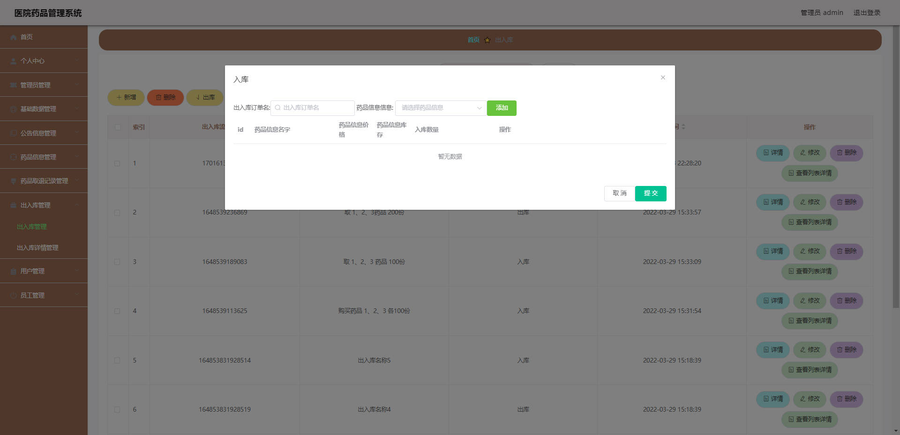

# 基于Springboot的医院药品管理系统

# Springboot-058

### 技术栈

Springboot mybatisplus vue

## 数据库

mysql (11张表)


## 功能描述

```properties
管理员
修改个人信息
修改密码
药品单位新增、修改、删除、查询
公告类型新增、修改、删除、查询
药品类型新增、修改、删除、查询
公告信息新增、修改、删除、查询
药品信息新增、修改、删除、查询
药品取退记录查看、新增、删除
出入库新增、查看、修改、删除
用户管理新增、修改、删除、查询
员工管理新增、修改、删除、查询
----------------------------------

员工
修改个人信息
修改密码
公告信息查看
药品信息查看
出入库新增、查看
药品取退记录查看、新增、删除
----------------------------------
用户:
修改个人信息
修改密码
公告信息查看
药品信息查看
药品取退记录查看
```


## 运行截图

### 前台

### 后台





## 访问网址

### 前台

```

```

### 后台

```
http://localhost:8080/yiyuanyaopinguanli/admin/dist/index.html#/login

账号 admin
密码 admin
```


##  技术交流或打赏

